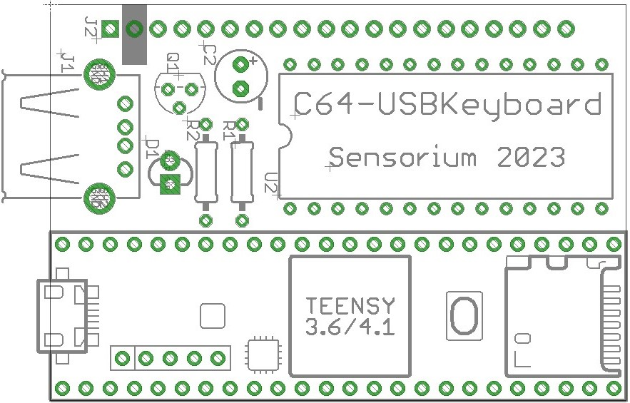

# C64 USB Keyboard PCB Assembly Instructions:

If there are additional questions, feel free to [contact me](mailto:travis@sensoriumembedded.com).

## Tools and Teensy prep:
- Tools/materials needed: 
  - Soldering iron/Solder (lead-free or otherwise)
  - Wire cutters (aka Side Cutters, Dykes)
  - Small knife (ie Exacto)
  - Computer with Arduino and the [Teensyduino app](https://www.pjrc.com/teensy/td_download.html) loaded.
  - Parts listed in the [TeensyROM BOM](https://github.com/SensoriumEmbedded/C64-USBKeyboard/raw/main/PCB/v0.1%20archive/C64toUSBKeyboard%20BOM.xlsx)
    - Including bare PCB [Link to design at OSH Park](https://oshpark.com/shared_projects/wqtal8dL)

- Programming the Teensy is done via the micro-USB connector on the Teensy itself.  This can create a problem with the 5v supply from the USB port driving against the 5v supply from your C64. Depending on how often you plan to update the firmware, choose one of the following two options.
  - Option 1 (recommended): For the ability to update firmware while connected to the C64 (with the C64 turned on, powering the Teensy), you’ll need to cut a small jumper on the bottom of the Teensy 4.1 itself, as shown in [this picture](https://raw.githubusercontent.com/SensoriumEmbedded/TeensyROM/main/media/Teensy/T41_pwr_cut.jpg).  This should be done prior to assembly since it is on the bottom of the Teensy module.  The jumper can remain cut and allows programming while powered from the C64 only.
  - Option 2: Remove the PCB from the C64 when programming the Teensy.  This will allow the USB 5v to power the Teensy for programming and not conflict with the C64 power.  When finished, disconnect the micro-USB connection and re-install in to your C64.  *Do not connect the Teensy to a computer and the C64 at the same time when using this option.*
 
## Assembly

- All components (except resistors) must be installed in propper orientation.
  - See silkscreen markings for each component during installation.
  - Capacitor (C2): Negative mark on cap should match negative mark on PCB
  - LED (D1): Square hole = short lead = flat side = Cathode
- Note that the Teensy requires both the two 24 pin headers as well as a 5 pin header to connect to the PCB
  - The 5 pin header carries the USB host signals to the connector, *very important*
- The connector to the C64(J2) is the only one installed from the bottom.

