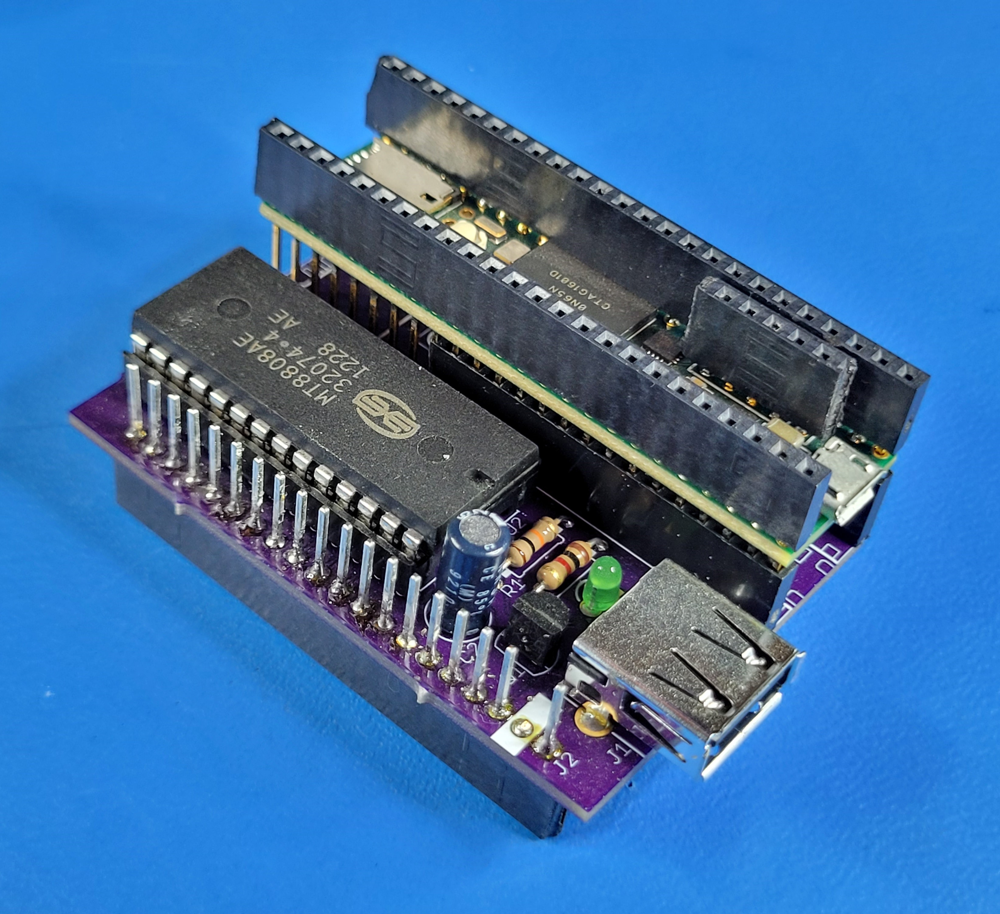
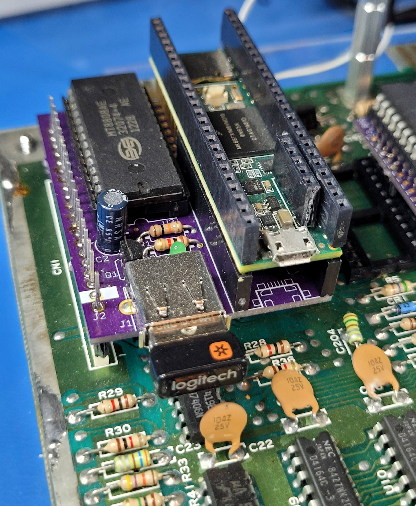

# C64-USBKeyboard

## USB keyboard interface for Commodore 64

**Original code and C64 Key Pos Mapping:**
* C64keyboard - Commodore Keyboard library
* Copyright (c) 2022 Hartland PC LLC, Written by Robert VanHazinga
    
    
**Rewritten/updated for Teensy 3.6/4.1:**
* Copyright (c) 2023 Sensorium Embedded, Written by Travis Smith
* Raw keypresss detection for improved emulation
* Ability to Shift special macro keys to c64 (F2/4/6/8, Cursor up/left, etc) 
* Diagnostics loopback emulation
* Symbol mapping for readability and easy editing
* Improved code clarity, fixed bugs
* PCB designed

Questions?  e-mail [Travis @ Sensorium](mailto:travis@sensoriumembedded.com)

Stand-alone and in-system pictures below.  Note that I have sockets above and below the Teensy module in my build. Actual build per BOM using headers will make it sit much lower (similar to the MT8808 chip)
||| 
|:--:|:--:|